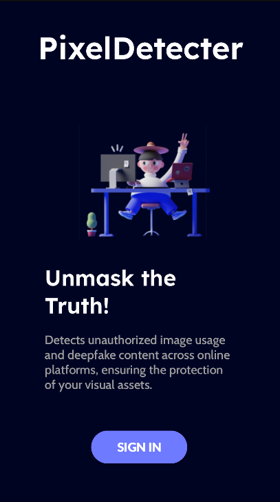
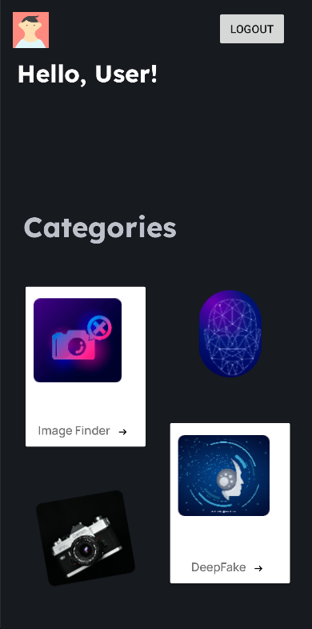
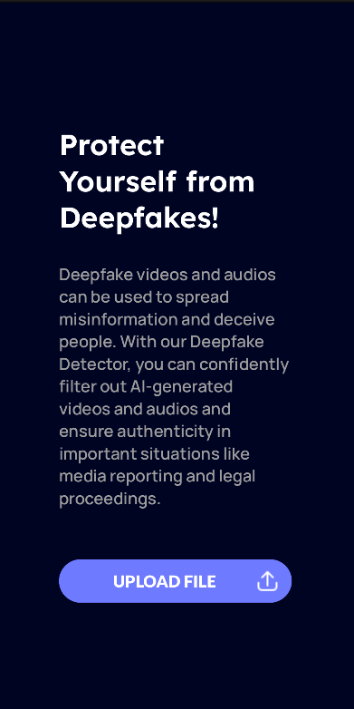
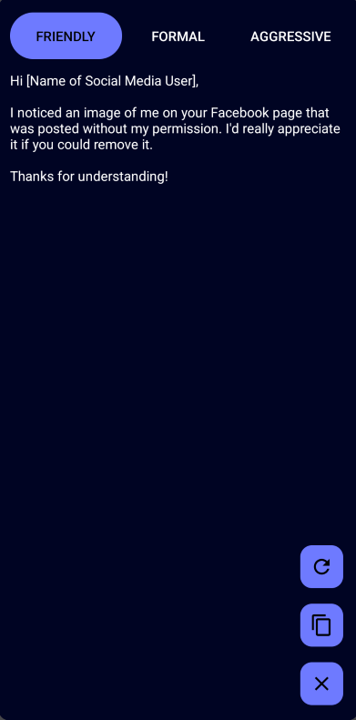

# PixelDetective

PixelDetective is an application designed to protect users' visual content on the internet. With its powerful picture detection feature, users can effortlessly monitor various online platforms to detect any unauthorized usage of their images. Additionally, PixelDetective offers advanced deepfake detection capabilities for both images and videos, providing users with valuable insights into the authenticity of their media files. Empower yourself with PictureGuard and safeguard your digital assets with ease.

## Screenshots

## Features

- Picture Detection:
   - Users can sign up for an account on PixelDetective and enter the url of the pictures from online platforms they want to monitor for unauthorized usage.
   - Monitor multiple online platforms to track the usage of your pictures without permission.
   - Users can generate a notice using AI in three different modes: Friendly, Formal and Aggressive.

- Deepfake Detection:

   - Users can upload both images and videos to the application for analysis.
   - PixelDetective employs state-of-the-art deepfake detection techniques to analyze media files.
   - The application provides users with detailed insights into the authenticity of the uploaded media, highlighting potential manipulations or deepfake elements.
   - Gain insights into the authenticity of media files and protect against malicious alterations.
    
## Usage

- Picture Detection:
    1) Sign up for an account:
    Create an account on PixelDetective using your email address.

    2) Upload pictures:
    Once logged in, upload the pictures you want to monitor for unauthorized usage.

- Deepfake Detection
    1) Upload media files:
    Select the video file you want to analyze for deepfake content.

    2) Wait for analysis:
    PixelDetective will process the uploaded media file using advanced deepfake detection api.

    3) View analysis results:
    Once analysis is complete, users can view detailed insights into the authenticity of the media file, including potential manipulations or deepfake elements detected.
